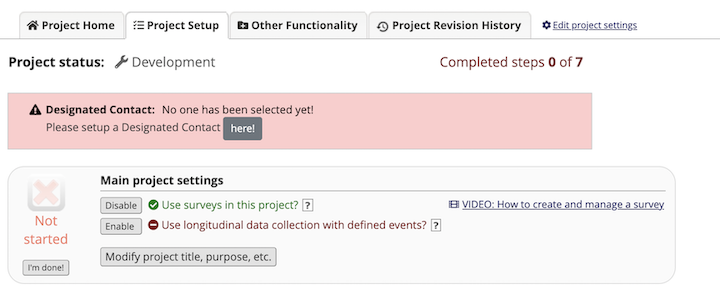
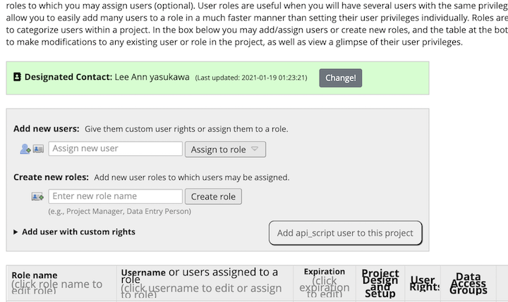

# Designated Contact EM

## Overview
This EM will prompt users part of a Redcap project, who have User Rights privileges, to select a designated
contact for the project. The project designated contact should be familiar with the Redcap project and
be familiar with the study. They will be the point person for any communications between the Redcap group
and the study group

Initially, a Designated Contact is not selected so the Project Setup page will display this message

for users who have User Rights privileges.  The message will also be placed on the User Rights page

Once a contact is selected and saved, the message on the Project Setup page disappears and the message
on the User Rights pages changes to

When a user is designated as Designated Contact for one or more Redcap projects, their project home
page will display an icon next to the project to indicate they are selected

## Setup
A Redcap project XML file is located in the xml directory which can be used as the
Designated Contact redcap project.  This file contains all the fields that the EM
populates. 

Once this Redcap project is created and this EM is installed, the EM system configuration
needs to be setup. The required parameters are:

    1) The EM must be Enabled on all Projects
    2) The Designated contact project must be specified
    3) The event id where the data will be stored must be specified

## Email Notifications
When a person is selected to be a Designated Contact, they will receive an email to notify them
that they were selected (except when self-selecting). If a person was previously selected as a
designated contact, they will receive an email an email that they are no longer selected (except
when self-deselecting).

The email body should be customized for each organization. The wording is stored at the top of the
saveNewContact.php file.
